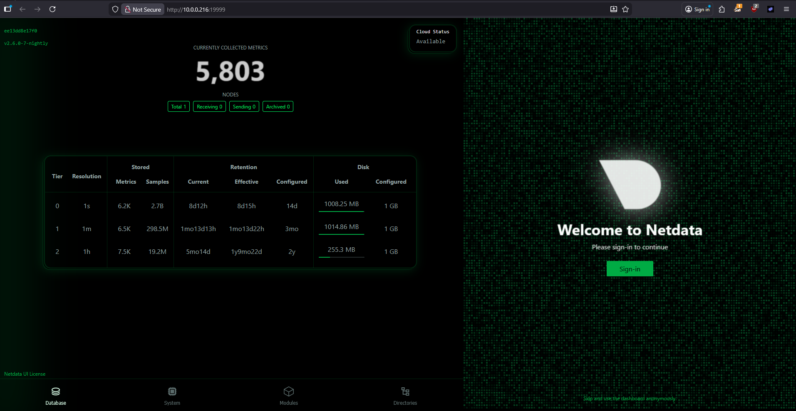
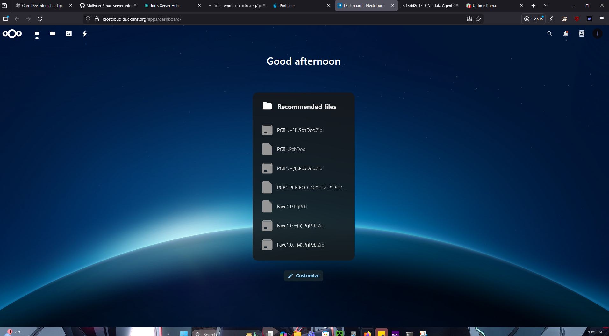
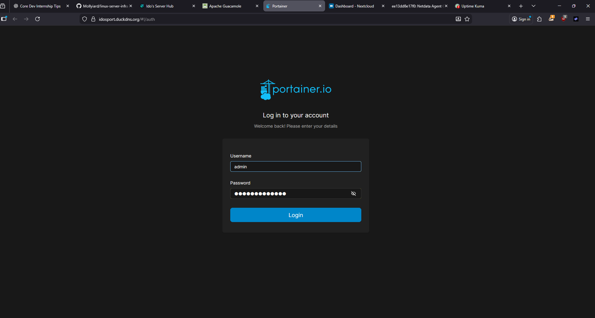
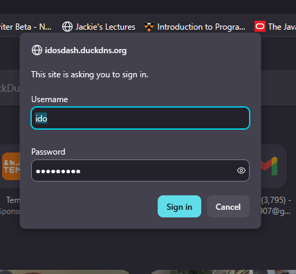
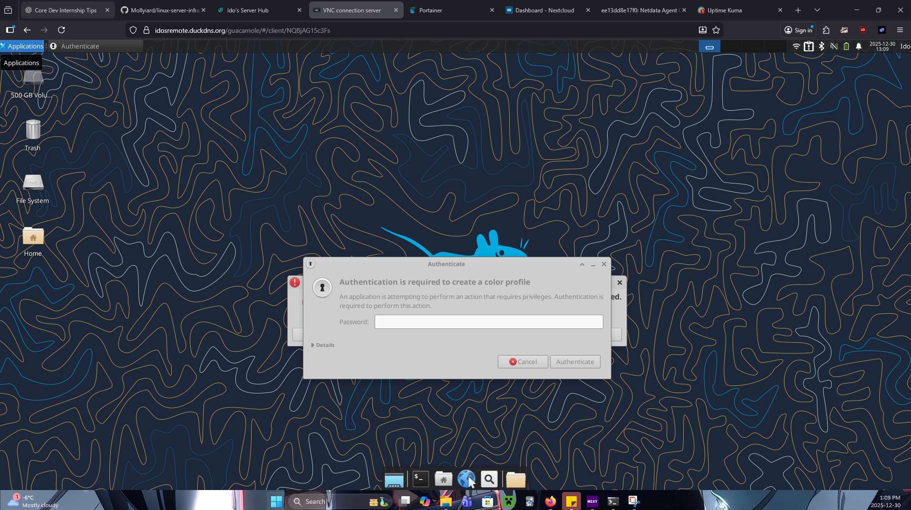

# Linux Server Infrastructure & Self-Hosted Services

A production-style Linux server used to host and manage multiple self-hosted services behind a secure reverse proxy, with containerization, automation, and remote access.

This repository documents the **infrastructure, configuration, and operational setup** of the system rather than application source code, mirroring real-world backend and DevOps workflows.

---

## Overview

This project represents a self-managed Linux server designed to run multiple services reliably and securely. The system uses Docker for service orchestration, Caddy for reverse proxying and HTTPS, and automation tools such as cron and systemd timers for maintenance and DNS updates.

The goal of this setup was to simulate and operate a **real production environment**, including deployment, routing, monitoring, and documentation.

---

## Architecture

**Core components:**
- Linux server (SSH-managed)
- Docker & Docker Compose for containerized services
- Caddy reverse proxy with automatic HTTPS
- DuckDNS for dynamic DNS updates
- Cron jobs and systemd timers for automation

## Screenshots

### Netdata – Real-Time System Monitoring

Live performance monitoring showing CPU, memory, disk, and network usage.  
Used to observe system health and diagnose issues in real time.

---

### Nextcloud – Self-Hosted Cloud Services

Self-hosted cloud platform running behind the reverse proxy, demonstrating secure service deployment and internal routing.

---

### Portainer – Container Management

Docker management interface used to monitor, start, stop, and inspect running containers across the server.

---

### Secure Access – Authentication Screen

Example of authentication protection in front of internal services, ensuring restricted access to administrative interfaces.

---

### Remote Access – VNC Connection

Remote graphical access to server-hosted environments, supporting administration and maintenance tasks beyond SSH.

---

